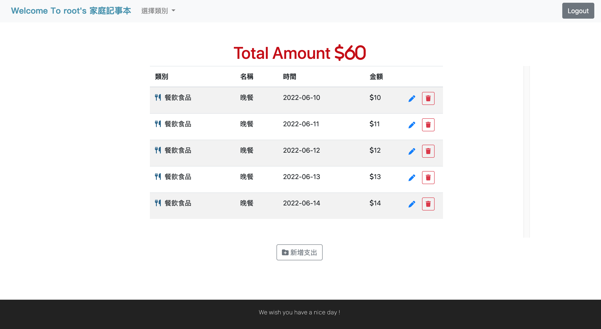

# expense-tracker


Is there something bothering you after you cost large expenditure ?
but you don't know those costs go to where ?
pleas don't worry ! from now on you can use this web to record any your costs !


## Features
- Users can create his/her account 
- Users can use third party login strategy of facebook,google,line to quickiy login, you even don't create your account!
- Users can record their costs go to where,even they can classify their costs to statistics which cost highest proportion


### Technology
- template engine -> Using template engine to covert files from html-like to html for browser
- router -> Using http GET POST etc.. to do route
- MONGODB -> Using mongoose  help app.js connect to database

### RESTful Api
Use the RESTful design pattern to reconstruction routes of app.js that makes developer more easier to read.

## **install and running steps**

> After downldad or clone this priject of github

１.Use terminal in the project

```properties
cd 'file name'
```

２.install node modules

```properties
npm install
```

３.Set environment variable:

> You can refer to env.example file to get any variables which you need.

４.Test the data of project by Seeder
> node
```properties
npm run seed
```


5.Run the project
> node
```properties
npm run start
```
> nodemon( if you need)
```properties
npm run dev
```

6.Browse the project on the browser

```
http://localhost:3000
```

If project is running , terminal will output
```
Listening on http://localhost:3000
```
If mongoDB is connecting , terminal will output 
```
mongodb connected
```
